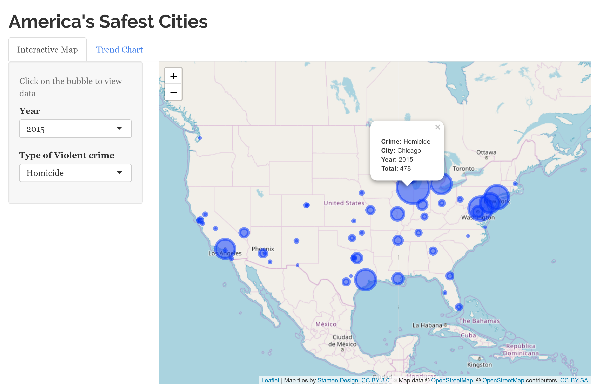
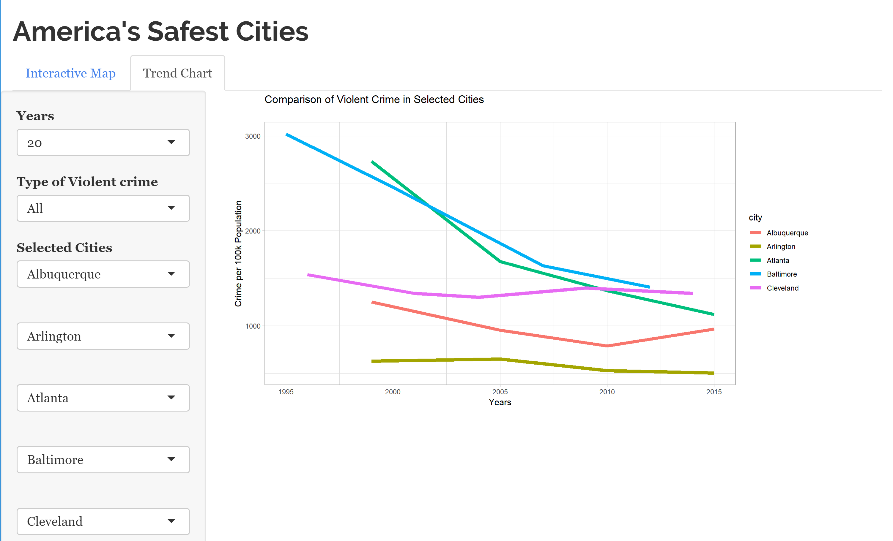

## Intuition and Rationale

### Tab 1: Map of the US

The first visualization is a map of the continental United States with a shape overlaid on each of cities' coordinates that represents either the total number of violent crime or rate of violent crime per 100,000 citizens in that city for a particular year.

The metrics will be represented by circles at the location of each city where the area of each circle will represent one of either the number or rate of **1 of 5 categories** for violent crime: homicide, aggravated assault, rape, robbery, or total; which is the previous four categories aggregated together. The larger the area of the circle is, the higher the total number of crime or the rate of crime per 100,000 for that city. The circles will be plotted centred on the coordinates of the city collected from a separate source/library. For further clarity and containment, by clicking once on any circle, a blob showing the city name, its ranking in that particular crime for that year, and the number/rate of crime for that year.

The intuition behind this map is that overlaying the major cities in the continental United States with the areas of the circles representing violent crime for each city can provide a clear way to compare and contrast crime numbers between the biggest hubs in America. By selecting a particular year and type of crime in the tab, the map will show the representative circles with an area proportional to the totals/rate of crime and the user will be able to eye-ball which cities had greater, similar, or less crime than others. 

There are some limitations to representing the values using area, such as inability to differentiate smaller values especially when the circles are further apart. Thus, we added (or will be adding for Milestone 3) to the side bar two smaller bar charts that show information of interest: 1) The 5 cities with the lowest crime number for the selected type of violent crime (i.e. Safest cities), 2) The 5 cities with the highest crime number for the selected type of violent crime (i.e. Dangerous cities). These two charts will supplement the map and make it easier to determine what the safest or most at-risk cities are.

### Tab 2: Line graph comparing crime rate between 5 cities

On the next tab, we have chosen to represent the trend of crime over time compared between the cities as a line graph. The user will have up to 5 cities to compare at once, and can choose one of the 5 different types of categories (homicide, aggravated assault, robbery, rape, or totals) to be aggregated and visualized. Each cities trend-line will be represented by a different color, with a legend to the side that contains the mappings (i.e. which city got which color). 

For the x-axis, we will be displaying the years, but we have chosen to take all the trends with a fixed time edge at 2015 (the most recent year with available data). This means that the user will be able to toggle between 2, 5, 10, 20 years **previous** to 2015. The intuition behind this is that visualizing the trend between 1975 and 1989 is not that important to show which of America’s cities are safest *now*. Rather, the intervals between 2013 and 2015 OR between 2010 and 2015 etc… will show what has been happening to the violent crime numbers in the years leading up to today. This way, the user can easily eye-ball which of the cities of interest are trending upwards, and which are trending downwards, and these could be a factor for determining which city is safest. For the y-axis, we have chosen to represent the rate of crime for each city. That is, the totals for each category divided by the population and scaled to 100,000. This provides a much fairer way to visualize the actual difference in crime rate between the cities when compared to displaying the totals.

## Tasks

For this milestone, the tasks were roughly the following:

* Clean available dataset and aggregate coordinate dataset:
- Add state column
- Add latitude and longitude columns from separate coordinate dataset
- Ensure major hubs are still present after the join
- Write to csv in the results folder

* Build map tab:
- Choose which shape/geometric object to display amount of crime (Circles, Heatmap, 3D bars, etc...)
- Identify which amount (total number or rate of crime) will be the default display
- Solve problem of overlapping shapes
- Add functionality for containment
- Add bar charts on sidepane that identify top 5 best/worst cities for the particular category.

* Build bar chart comparator tab:
- Add 5 cities to comparison
- Choose good colours
- Implement fixed edge feature on x-axis

## Screenshots

Tab 1: Interactive map to explore violent crime statisitics in America

Tab 2: Line chart to compare violent crime trend in selected cities

## Bugs

Some of the bugs that were encountered along the way were some issues aggregating the data using the R script that caused some of the cities to go missing. Also, for the line graph, some of the cities were not getting scaled and/or represented properly. This way an issue that may have been caused by the presence of some NA’s in the data set. The data cleaning script was implemented to remove all the NA’s in the set and assisted with this problem, but may likely have caused missing data in the time series.

## Vision & Next Steps

For the following milestone, the overall vision is to fine-tune the map visualization which is proving to be a bit more difficult than expected when combining coordinate data and deciding which of the shapes and opacities to be used when representing the amount/rate of crime. The main feature that was not implemented in time for this milestone was the bar charts in the map tab that show the top/worst 5 cities for that year in the US. 

Specifically, for the vision and next steps, our main tasks for milestone 2 are:

- Getting more than 60 cities through in the data cleaning script
- Adding the bar charts in the map tab
- Add a national column by aggregating all the cities in the set
- Adding toggles/buttons for time options in line graph tab
