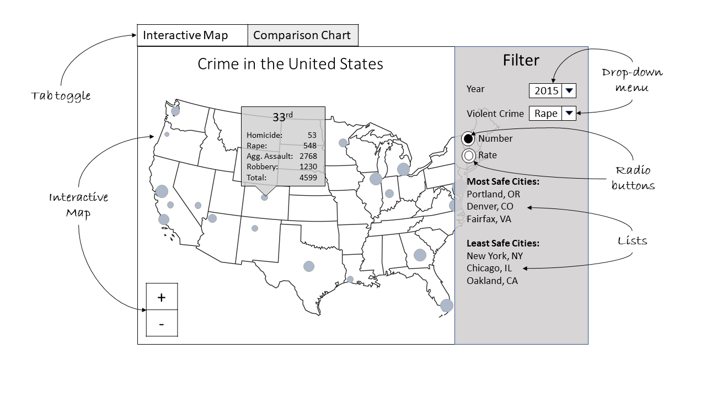
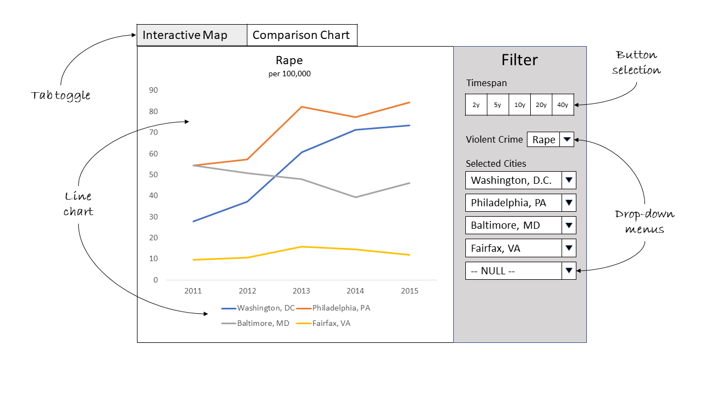

## Overview

Crime continues to be on the rise in our streets! Or so has been the narrative that's been thrown around by the media for as long as anyone can remember.

And yet here we are in 2019, with people and life going on as normal for the majority of Americans. So what actually did happen to violent crime in the USA?

The Marshall Project, a nonprofit, nonpartisan online journalism organization, based out of New York City, have compiled a dataset that contains the numbers and rates of violent crime for the major cities in the US spanning the last 40 years.

Using this dataset, our aim is to build a visualization tool that will serve two main purposes. First, to highlight the difference over time in crime rates in each individual city. Second, to compare crime rates between the cities. The goal is to present this information in an easy-to-digest manner for the general public, such that everyday Americans can use the interactive map to explore violent crime statistics from major cities. The accompanying charts allow easy comparison of violent crime trends for selected cities.

## Description of the data

The dataset that we’ll be using is the one compiled by the Marshall project detailing the number and rate of violent crimes that occurred in 68 cities in the United States between 1975 and 2015. The four types of violent crime that they have compiled information on are:

1) Homicide
2) Rape
3) Robbery
4) Aggravated Assault

The information on each type of crime for each city in a specific year is presented in raw format (or totals), and is also presented in normalized format that is the rate of the type of crime per 100,000 people. The two of these in tandem could give us a clearer indication of whether a city is trending upwards or downwards with regards to violent crime better than totals only, as the normalized numbers adjust for size of population. For this, the dataset includes a field that reports the population of each city that adjusts year after year with updated population totals.

Specifically, they have collected information on 17 fields, some derived from others and they are compiled in the table below:

 | Name of field    | Description |
 | -----------------|-------------------------|
 | ORI              | Unique Identifier |
 | year             | The year the statistics are compiled for |
 | department_name  | City name |
 | total_pop        | Total population |
 | homs_sum         | Total number of homicides |
 | rape_sum         | Total number of rapes |
 | rob_sum          | Total number of robberies |
 | agg_ass_sum      | Total number of aggravated assault |
 | homs_per_100k    | Homicides per 100,000 people |
 | rape_per_100k    | Rapes per 100,000 people |
 | rob_per_100k     | Robberies per 100,000 people |
 | agg_ass_per_100k | Agg. Assault per 100,000 people |
 | violent_crime    | Total number of violent crime |
 | violent_per_100k | Violent crime per 100,000 people |
 | months_reported  | Number of months in the year that crime was reported |

 For the purposes of this investigation, we will disregard the 'source' and 'url' columns. For the `months_reported` field, we'll only be considering crime statistics where all 12 months were reported. Otherwise, this may skew results especially when comparing rates.

## Usage scenarios & tasks

Jim and Sally are new parents looking to move to a safe city in the United States to raise their daughter. For major U.S. cities (population over 250,000), they want to [explore] violent crime figures, [compare] these figures for their favorite cities and [identify] the overall safest cities to choose the ideal city as their future hometown. Jim and Sally can use the “America’s Safest Cities” app for their search, which presents information in an interactive map and accompanying charts. The interactive map along with suggested safest cities helps them explore different cities around the country. They shortlist 4 cities of their choice to compare in detail. They filter the comparison charts for the shortlisted cities which helps provide a detailed breakdown of violent crime in those cities. They contrast violent crime statistics of the shortlisted cities against the safest cities in the United States.

## Description of app and initial sketch

The first tab is an interactive map with filtering criterion that displays major U.S. cities as circles sized in proportion to selected violent crime category. The user can filter year, violent crime category, and statistics as raw numbers or rate over 100,000 population. In the year drop down menu, the option is available to select any year between 1975 to 2015. The default selected year will be 2015. The violent crime category drop down allows viewing data for homicide, rape, robbery, aggravated assault or all categories combined. The default will be all categories combined. The toggle allows visualizing statistics as raw numbers or rate over 100,000 population. The default will be raw numbers. The filter pane will also contain two lists ranking most and least safe cities for selected violent crime category. The interactive map allows zooming and moving to different regions of the map, along with clicking a city’s circle to view it’s ranking as the most safe city and detailed statistics of the selected violent crime category.

The second tab contains comparison line charts for selected timespan, violent crime category and cities. The data compared will be the rate over 100,000 population. The timespan option allows varying the start year while the end year remains 2015. This makes the analysis simpler allowing the user to compare the trend of crime going 2, 5, 10, 20 or 40 years back. The default selection will be 5 years. Similar to the interactive map, the violent crime category drop down allows viewing data for homicide, rape, robbery, aggravated assault or all categories combined. The default will be all categories combined. The user can pick the cities of their choice in the selected cities drop down menus to compare.

Tab 1: Interactive map to explore violent crime statisitics in America

Tab 2: Line chart to compare violent crime trend in selected cities
